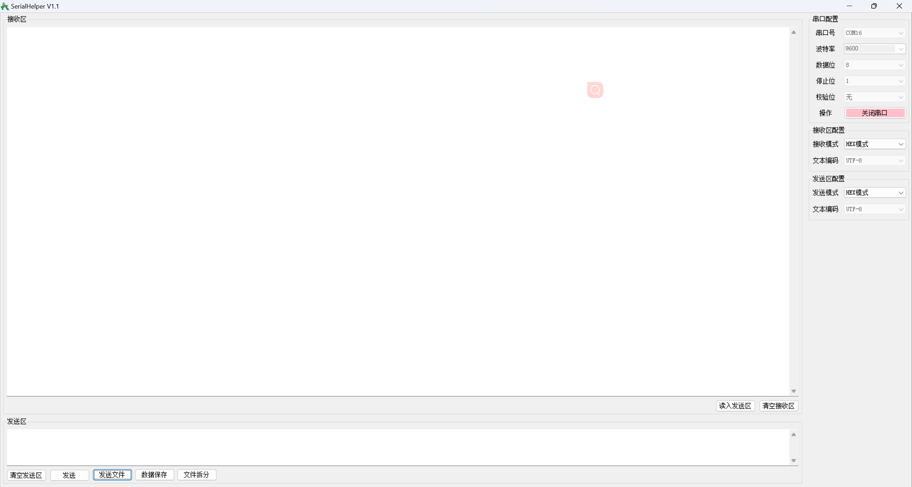

# WR4W25QXX

## 总述

该项目主要是对W25Q64系列进行读写，读写是没有对数据进行如FF ... FE 这种封装，只做了4K对齐，不足4K补FF。
包含：
  1，Keil5 Flash读写程序
  2，Winform 串口助手
  **注**：该串口助手由 【**江协科技**提供的串口助手代码升级而来，进行魔改，配合Flash读写程序进行使用】【来源：https://jiangxiekeji.com/download.html】
Flash读写程序由C语言完成，以4K为单位进行读写，串口助手每次发送数据也会以4K为单位进行发送，不足4K会对齐。


---

## 串口程序

串口程序如下图所示：



功能说明：

- 该串口程序包含基本的数据发送和接收功能【江协科技提供】
- 发送文件：将文件以4K为单位进行串口发送【先拆分为一个一个的4K大小的二进制文件，再依次发送】
- 数据保存：将收到的数据保存为二进制文件
- 文件拆分：将选择的文件拆分为一个一个的4K大小的数据文件

---

## Flash读写

Keil5 Flash读写程序：【50MHZ 9600 8bit 停止位1 校验位0】

说明：

- 串口：

  ```C
  void Serial_Init(void)
  {
  	RCC_APB2PeriphClockCmd(RCC_APB2Periph_USART1, ENABLE);
  	RCC_APB2PeriphClockCmd(RCC_APB2Periph_GPIOA, ENABLE);
  	
  	GPIO_InitTypeDef GPIO_InitStructure;
  	GPIO_InitStructure.GPIO_Mode = GPIO_Mode_AF_PP;
  	GPIO_InitStructure.GPIO_Pin = GPIO_Pin_9;
  	GPIO_InitStructure.GPIO_Speed = GPIO_Speed_50MHz;
  	GPIO_Init(GPIOA, &GPIO_InitStructure);
  	
  	GPIO_InitStructure.GPIO_Mode = GPIO_Mode_IPU; //上拉输入
  	GPIO_InitStructure.GPIO_Pin = GPIO_Pin_10;
  	GPIO_InitStructure.GPIO_Speed = GPIO_Speed_50MHz;
  	GPIO_Init(GPIOA, &GPIO_InitStructure);
  	
  	USART_InitTypeDef USART_InitStructure;
  	USART_InitStructure.USART_BaudRate = 9600;
  	USART_InitStructure.USART_HardwareFlowControl = USART_HardwareFlowControl_None;
  	USART_InitStructure.USART_Mode = USART_Mode_Tx | USART_Mode_Rx;
  	USART_InitStructure.USART_Parity = USART_Parity_No;
  	USART_InitStructure.USART_StopBits = USART_StopBits_1;
  	USART_InitStructure.USART_WordLength = USART_WordLength_8b;
  	USART_Init(USART1, &USART_InitStructure);
  	
  	USART_ITConfig(USART1, USART_IT_RXNE, ENABLE);
  	
  	NVIC_PriorityGroupConfig(NVIC_PriorityGroup_2);
  	
  	NVIC_InitTypeDef NVIC_InitStructure;
  	NVIC_InitStructure.NVIC_IRQChannel = USART1_IRQn;
  	NVIC_InitStructure.NVIC_IRQChannelCmd = ENABLE;
  	NVIC_InitStructure.NVIC_IRQChannelPreemptionPriority = 1;
  	NVIC_InitStructure.NVIC_IRQChannelSubPriority = 1;
  	NVIC_Init(&NVIC_InitStructure);
  	
  	USART_Cmd(USART1, ENABLE);
  }
  ```

- SPI:

  ```C
  void MySPI_Init(void)
  {
  	RCC_APB2PeriphClockCmd(RCC_APB2Periph_GPIOA, ENABLE);
  	
  	GPIO_InitTypeDef GPIO_InitStructure;
  	GPIO_InitStructure.GPIO_Mode = GPIO_Mode_Out_PP;
  	GPIO_InitStructure.GPIO_Pin = GPIO_Pin_4 | GPIO_Pin_5 | GPIO_Pin_7;
  	GPIO_InitStructure.GPIO_Speed = GPIO_Speed_50MHz;
  	GPIO_Init(GPIOA, &GPIO_InitStructure);
  	
  	GPIO_InitStructure.GPIO_Mode = GPIO_Mode_IPU;
  	// MISO: M-P6: STM62 S-DO: W25Q64 
  	GPIO_InitStructure.GPIO_Pin = GPIO_Pin_6;
  	GPIO_InitStructure.GPIO_Speed = GPIO_Speed_50MHz;
  	GPIO_Init(GPIOA, &GPIO_InitStructure);
  	
  	MySPI_W_SS(1);
  	MySPI_W_SCK(0);
  }
  
  // 模式0交换一个字节【优化：移位模型】
  uint8_t MySPI_SwapByte(uint8_t ByteSend)
  {
  	uint8_t i;
  	// 向S从机发送，向M主机返回数据
  	for (i = 0; i < 8; i ++)
  	{
  		MySPI_W_MOSI(ByteSend & 0x80); //输出最高位
  		ByteSend <<= 1; //最低位自动补0
  		MySPI_W_SCK(1);
  		if (MySPI_R_MISO() == 1){ByteSend |= 0x01;} //如果M接收到的数据是1,就放到最低位
  		MySPI_W_SCK(0);
  	}
  	
  	return ByteSend;
  }
  ```

- W25Q64: 4K写入算法

  ```C
  void W25Q64_SectorProgram(uint32_t Address, uint8_t *DataArray, uint16_t Count)
  {
  	uint16_t PageByte = 256 - Address % 256;
  	if (Count <= PageByte)
  	{
  		PageByte = Count;
  	}
  	
  	while(1)
  	{
  		W25Q64_PageProgram(Address, DataArray, PageByte);
  		if(Count == PageByte)
  		{
  			break;
  		} else 
  		{
  			DataArray += PageByte;
  			Address += PageByte;
  			Count -= PageByte; 
  			if(Count > 256) 
  			{
  				PageByte = 256;
  			} else 
  			{
  				PageByte = Count;
  			}
  		}
  	}
  }
  ```

  

  

  
